# Práctica 1: Ejercicios Unity

Aquí se puede encontrar los ejercicios de Unity con sus explicaciones y videos.

## Ejercicio 1

Para este ejercicio he sacado al inspector dos campos:
1. `frameInterval`: la cantidad de frames que espera el bucle para actualizar la posición y el color del cubo.
2. `positionRange`: el rango de desplazamiento del cubo.

Cuando el contador de frames es mayor o igual que `frameInterval`, se actualiza la posición y el color del cubo.

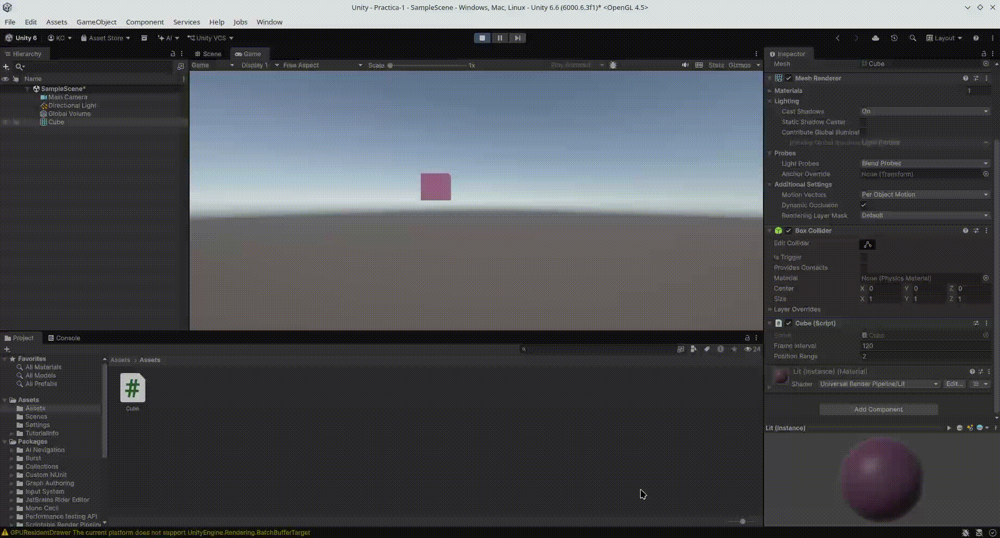

## Ejercicio 2

He declarado todas las variables públicas necesarias para cada operación, y por cada operación que se pide en el ejercicio, asigno el resultado al campo correspondiente e imprimo el resultado por la consola. 

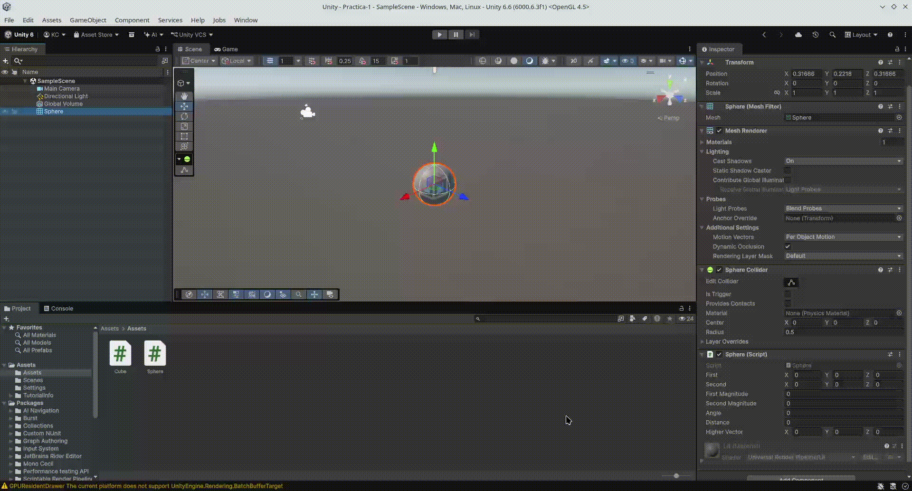

## Ejercicio 3

He declarado un atributo público de tipo `Text`, y en el editor arrastré el objeto del mismo tipo que había creado anteriormente. De esta forma, he conseguido obtener la referencia al campo de texto, cuyo contenido se actualiza en la función `Update` en cada frame.

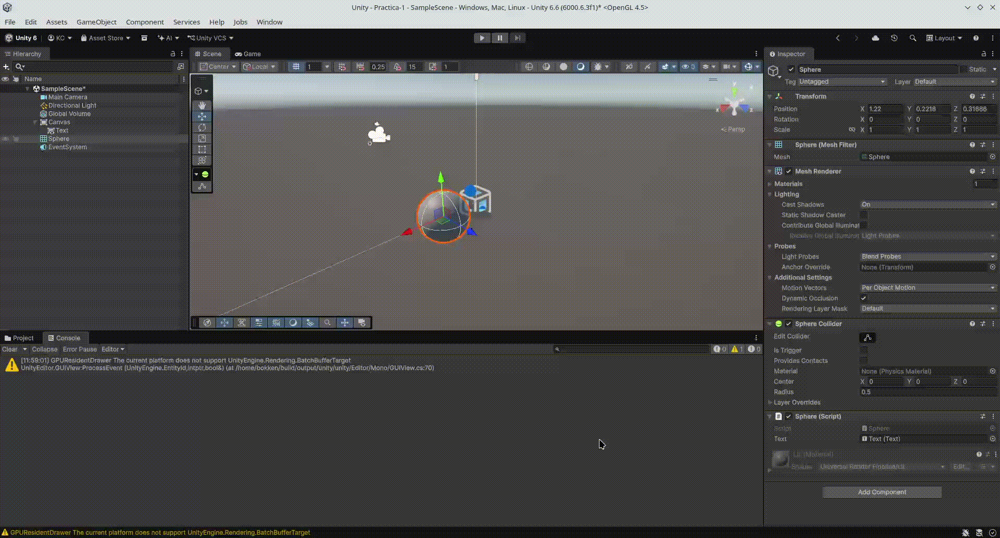

## Ejercicio 4

En este ejercicio tuve que crear dos scripts. El primer script es un componente reutilizable que asigné al cubo y al cilindro. El componente almacena un atributo `distance` público. En la función `Start` se encuentra el objeto con tag `Esfera` y se calcula la distancia.

En el script de la esfera tengo la referencia al cubo y cilindro (más bien al componente `DistanceToSphere`). Allí accedo al atributo `distance` del cubo y cilindro e imprimo la distancia por la consola.

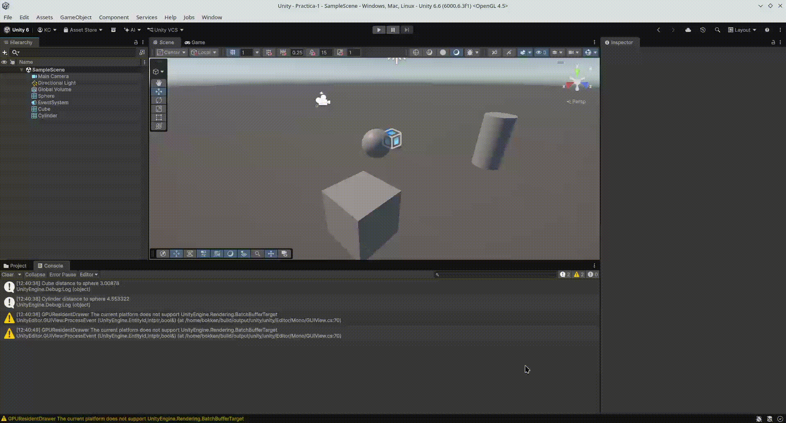

## Ejercicio 5

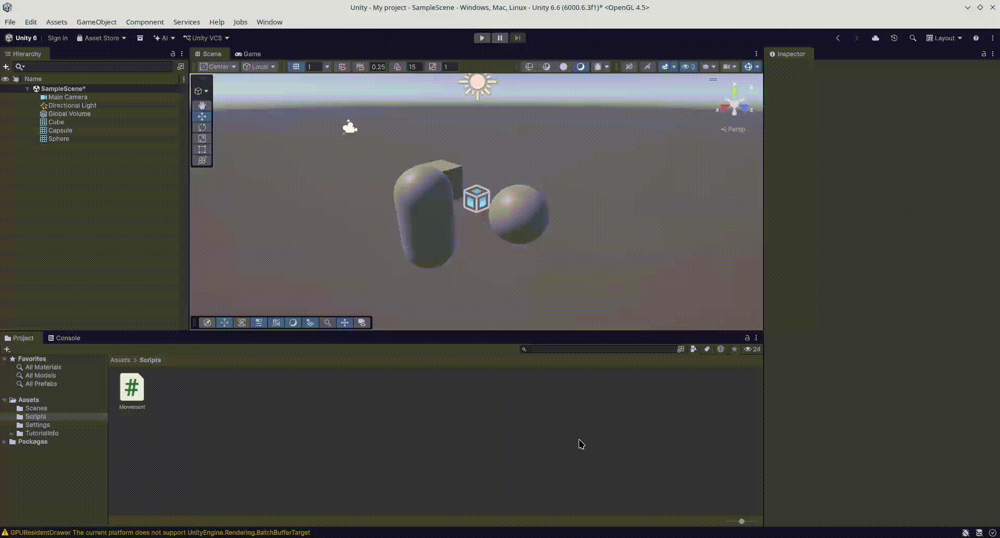

## Ejercicio 6

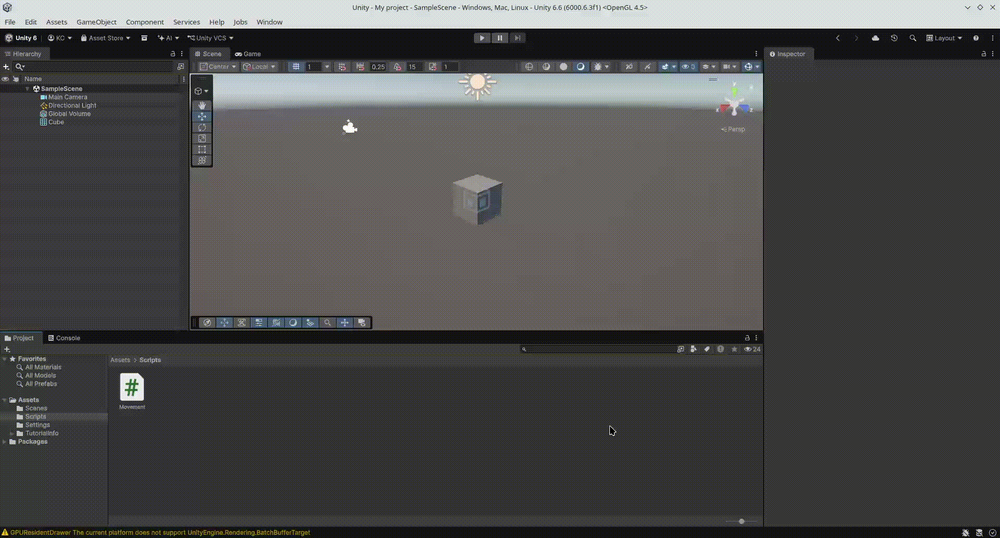

## Ejercicio 7

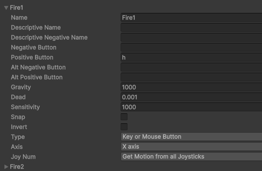

## Ejercicio 8

a) La velocidad del cubo se duplica, ya que el vector tiene el doble de longitud.  
b) Se dubplica la velocidad del cubo, igual que en el ejercicio anterior.  
c) El movimiento sigue ocurriendo en la misma dirección pero de forma más lenta.  
d) El cubo no se cae, se desplaza en la dirección del vector `moveDirection`, ya que no le afecta la gravedad.  
e)
 - Space.World: El cubo se desplaza respecto a los ejes globales de la escena. Aunque el cubo esté rotado, el vector (1, 0, 0) siempre
                lo moverá hacia la derecha absoluta de la escena.  
 - Space.Self: El cubo se desplaza alineado a sus propios ejes locales. Si el cubo está rotado 45° e intento
               moverlo en el eje z, avanzará hacia donde apunte su parte delantera.  

## Ejercicio 9

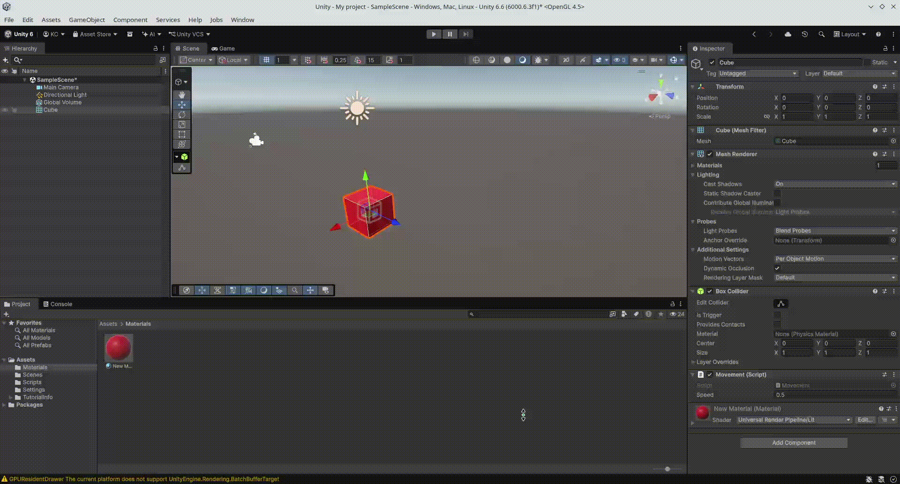

## Ejercicio 10

## Ejercicio 11

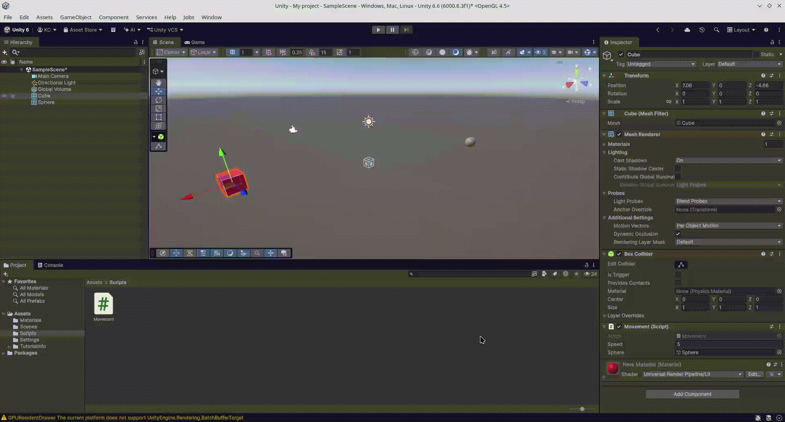

## Ejercicio 12

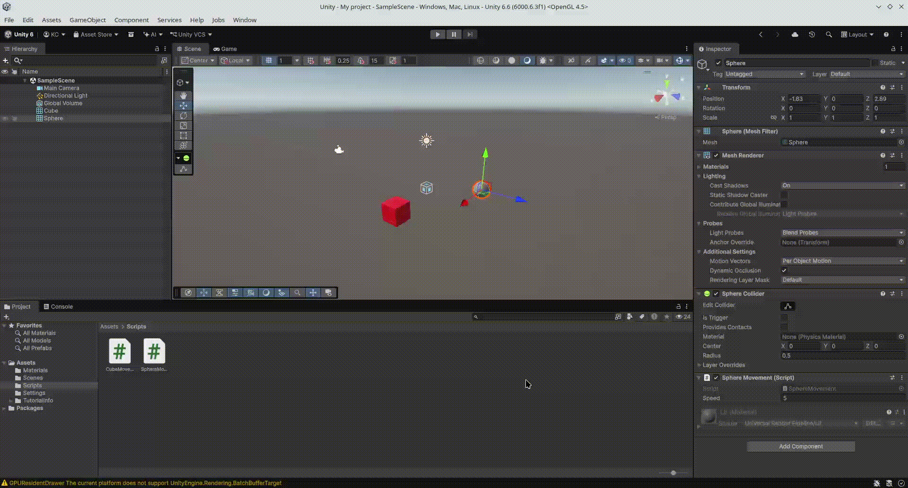

## Ejercicio 13

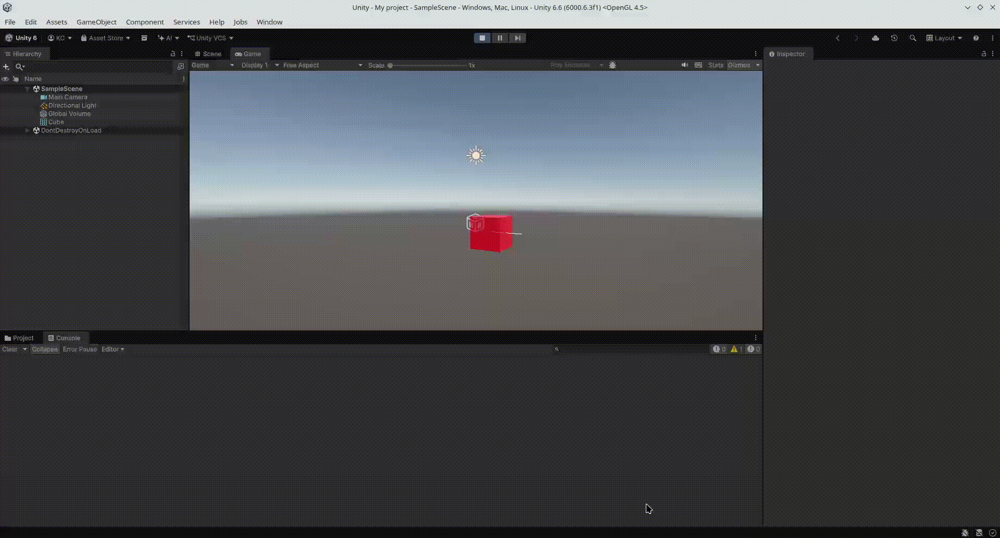
